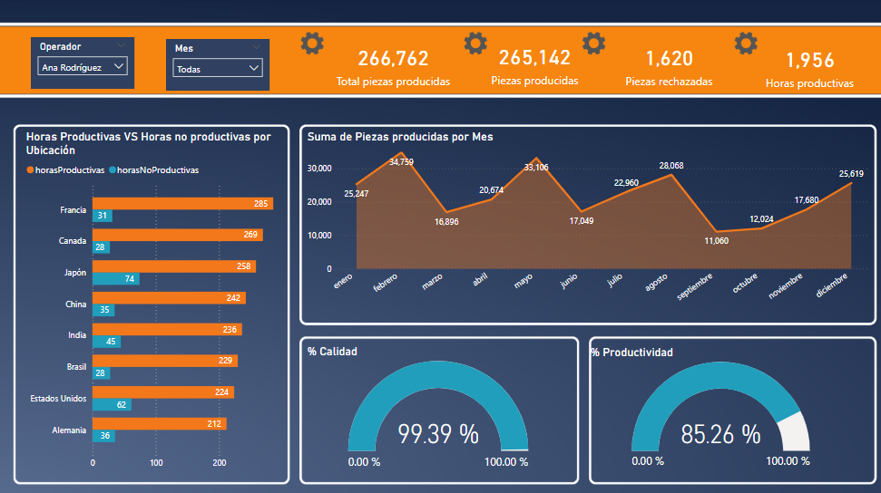

# 📊 Power BI Dashboard: Production Analysis

## 📚 Table of Contents
- [Overview](#-overview)
- [Dashboard Components](#-dashboard-components)
  - [Summary Statistics](#1%EF%B8%8F⃣-summary-statistics)
  - [Visualizations](#2%EF%B8%8F⃣-visualizations)
  - [Filters](#3%EF%B8%8F⃣-filters)
- [Dashboard Views](#-dashboard-views)
- [Conclusions](#-conclusions)

## 📌 Overview
This Power BI dashboard provides a detailed analysis of production performance using a dataset that includes key operational metrics. The dataset consists of the following columns:

- **No. Orden**: Order number.
- **Operador**: Operator responsible for production.
- **Ubicación**: Location of the operation.
- **Producto**: Product being manufactured.
- **Obstáculos**: Issues encountered during production.
- **Fecha Inicio / Hora Inicio**: Start date and time.
- **Fecha Fin / Hora Fin**: End date and time.
- **Total Horas**: Total hours spent on production.
- **Piezas producidas**: Number of produced pieces.
- **Piezas rechazadas**: Number of rejected pieces.

## 📈 Dashboard Components

### 1️⃣ Summary Statistics
- Total **produced pieces**, **rejected pieces**, and **productive hours**.

### 2️⃣ Visualizations
- **Dual Bar Chart**: Compares productive vs. non-productive hours by country.
- **Area Chart**: Displays the total produced pieces per month.
- **KPIs**:
  - **Productivity Percentage**.
  - **Quality Percentage**.

### 3️⃣ Filters
- **Filter by Operator**
- **Filter by Month**

## 🖼️ Dashboard Views

### 🔹 Default View (No Filters Applied)

### 🔹 Filtered by Operator

### 🔹 Filtered by Month

## 🔍 Conclusions
- The dashboard provides a clear **overview of production efficiency**.
- **Identifies bottlenecks** by analyzing obstacles and non-productive hours.
- Helps in **monitoring operator performance** and overall **quality control**.
- The filtering options allow for **better insight into specific trends** over time.

🚀 *This tool enhances decision-making and continuous improvement in production management!*

